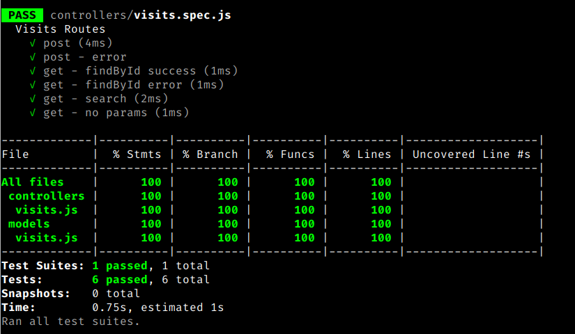

## Description

Express API with MongoDB backend. The MongoDB docker image was used for local development. The production version is running on an EC2 instance via the [docker-compose.yml](docker-compose.yml) file. A Docker volume is used to persist data upon restarts. Controllers have 100% test coverage with Jest.

